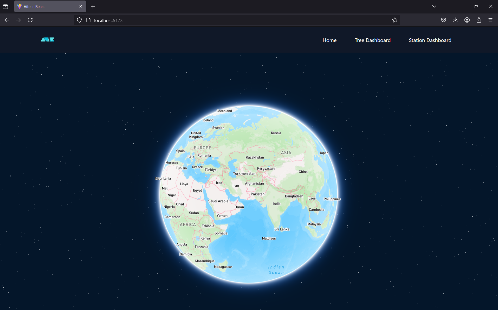
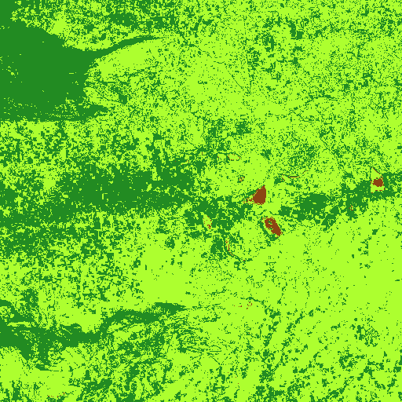

# Web Application for AV10 - NDVI Mapping (Under Development)

 


This web application, developed by AV10, is a geospatial tool for visualizing Normalized Difference Vegetation Index (NDVI) data derived from Sentinel satellite imagery. Built using Vite, React.js, Mapbox API, and a Flask backend, it offers an interactive map-based interface for exploring vegetation health.

## Features

* **NDVI Visualization:** Displays NDVI values as color-coded overlays on a Mapbox map.
* **Sentinel Satellite Data:** Utilizes Sentinel satellite data for accurate NDVI calculations.
* **Interactive Map:** Allows users to zoom, pan, and explore different geographic regions.
* **Flask Backend:** Provides data processing and API endpoints for retrieving NDVI data.
* **Vite React.js Frontend:** Offers a responsive and user-friendly interface.

## Technologies Used

* **Frontend:**
    * React.js: For building the user interface.
    * Vite: For fast development and build processes.
    * Mapbox API: For interactive map visualization.
* **Backend:**
    * Flask: For creating the API and handling data requests.
    * Python: Backend Language.
    * (Add any other Python libraries you used, e.g., NumPy, GDAL, etc.)
* **Satellite Data:**
    * Sentinel Satellite Imagery.

## Setup Instructions

1.  **Clone the Repository:**

    ```bash
    git clone [https://github.com/team-av10/webapplication.git](https://github.com/team-av10/webapplication.git)
    cd webapplication
    ```

2.  **Backend Setup (Flask):**

    * Navigate to the backend directory.
    * Create a virtual environment (recommended):

        ```bash
        python -m venv venv
        source venv/bin/activate  # On Linux/macOS
        venv\Scripts\activate      # On Windows
        ```

    * Install dependencies:

        ```bash
        pip install -r backend/requirements.txt
        ```

    * Configure Mapbox API key and any other necessary environment variables.
    * Run the Flask application:

        ```bash
        python backend/app.py
        ```

3.  **Frontend Setup (React/Vite):**

    * Navigate to the frontend directory.
    * Install dependencies:

        ```bash
        npm install
        ```

    * Configure Mapbox API key in the frontend code.
    * Start the development server:

        ```bash
        npm run dev
        ```

4.  **Access the Application:**

    * Open your web browser and navigate to the URL displayed by the Vite development server (usually `http://localhost:5173`).

## Configuration

* **Mapbox API Key:** You will need a Mapbox API key to use the map functionality. Add your API key to the appropriate configuration files in both the frontend and backend.
* **Backend API Endpoint:** The frontend needs to know the URL of your Flask backend API. Configure this in the frontend code.
* **Sentinel Data Source:** If you are using a specific source or file format for Sentinel data, ensure that the backend is configured to read and process it correctly.

## Future Enhancements

* Add time-series analysis of NDVI data.
* Implement user-defined region selection for NDVI analysis.
* Integrate additional satellite data sources.
* Add more visualization options (e.g., contour plots, 3D visualizations).
* Improve user interface and user experience.

## Contributing

Contributions to this project are welcome. Please fork the repository and submit a pull request with your changes.

## License

(Add your project's license here, e.g., MIT License)
